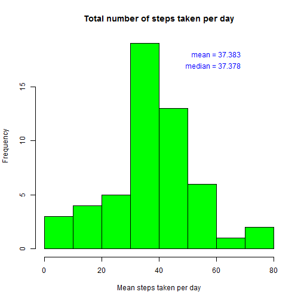
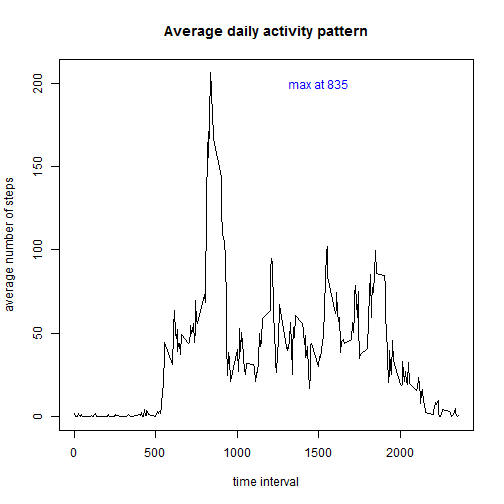
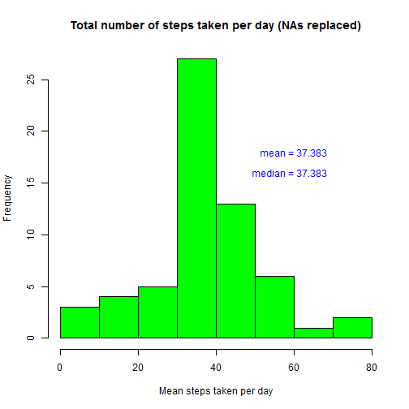
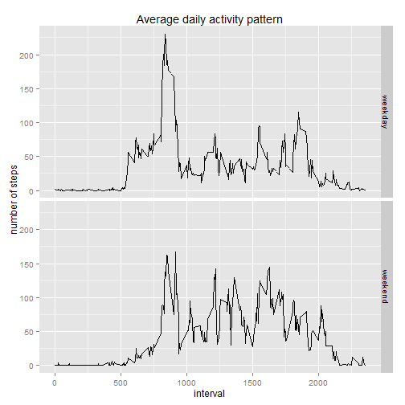

# Loading the data

The first step is to load the data and to load packages useful for the analysis


```r
data <- read.csv("activity.csv", header = TRUE)
library(dplyr)
library(ggplot2)
data <- tbl_df(data)
```

# Total number of steps taken per day

The code calculates the total number of steps taken per day, ignoring the missing values, and produces a histogram. Finally, it calculates and reports the mean and median of the total steps per day.


```r
by_date <- group_by(data, date) #creates a table grouped by date 
summary <- summarize(by_date, mean(steps)) # calculates the average number of total steps per day
hist(summary$`mean(steps)`, col="green", main = "Total number of steps taken per day", xlab = "Mean steps taken per day") # generates histogram
overall_summary <- summarize(summary, mean(`mean(steps)`, na.rm = T), median(`mean(steps)`, na.rm = T)) # calculates mean and median of the average number of total steps per day
names(overall_summary)<-c("mean", "median") # renames columns to make them more readable
text(60,18,labels=paste("mean =", round(overall_summary$mean,3)), col="blue") # reports mean value on graph
text(59,17,labels=paste("median =", round(overall_summary$median,3)), col="blue") # reports median value on graph
```

 

# Average daily activity pattern

The code calculates and plots the average number of steps by time interval. It then calculates and reports the time interval corresponding with the maximum average number of steps.


```r
by_interval <- group_by(data, interval) #creates a table grouped by interval 
summary_int <- summarize(by_interval, mean(steps, na.rm = T)) # calculates the average number of total steps per interval
colnames(summary_int)[2] <- "mean" # renames column to make it more readable
with(summary_int, plot(summary_int$interval,summary_int$mean, main = "Average daily activity pattern", type = "l", xlab = "time interval", ylab = "average number of steps")) # generates plot
summary_int_sorted <- arrange(summary_int, desc(mean)) # Sorts dataset of means to have max value on top
text(1500,200,labels=paste("max at", summary_int_sorted[1,1]), col="blue") # reports interval corresponding to max value of average steps
```

 

# Imputing Missing Values

This code calculates the number of missing values in the dataset 


```r
sum(is.na(data$steps)) # counts the cases of NA in the steps column
```

```
## [1] 2304
```


In order to fill in all the missing values, we use the mean of each five-minute interval calculated before and create a new dataset which contains such means instead of the missing values. This is deemed to be a better and more neutral approach than using averages across all intervals. The replacement of NAs is achieved by first creating a dataset of the missing values only, and one of the non-missing values; then the data frame with missing values is joined to the table of average steps by interval, in order to get an average value for each interval that is NA. Finally the dataset of "replacement"" values is appended to the one of non-missing values. 


```r
missing_intervals <- data[is.na(data$steps),] # creates a dataset of the missing cases
data_not_missing <- data[!is.na(data$steps),] # creates a dataset of the non-missing cases 
replacements <- inner_join(missing_intervals, summary_int) # creates a replacement dataset by merging the dataset of missing cases with the one containing the average steps by interval
```

```
## Joining by: "interval"
```

```r
replacements <- select(replacements, mean, date, interval) # selects only the relevant columns
colnames(replacements)[1] <- "steps" # renames the column containing the average steps to makes it the column names the same as the ones in the original dataset
data_na_replaced <- rbind(data_not_missing, replacements) # appends the dataset with the replacement values to the dataset of the non-missing cases
data_na_replaced <- arrange(data_na_replaced, date, interval) # re-establishes original sorting of the overall dataset
```


The following code mimicks the process followed under "Total number of steps taken per day" above, but using the revised dataset, which contains average values in place of missing values. It calculates the total number of steps taken per day, and produces a histogram. Finally, it calculates and reports the mean and median of the total steps per day.


```r
by_date_na_replaced <- group_by(data_na_replaced, date) #creates a table grouped by date 
summary_na_replaced <- summarize(by_date_na_replaced, mean(steps)) # calculates the average number of total steps per day
hist(summary_na_replaced$`mean(steps)`, col="green", main = "Total number of steps taken per day (NAs replaced)", xlab = "Mean steps taken per day") # generates histogram
overall_summary_na_replaced <- summarize(summary_na_replaced, mean(`mean(steps)`, na.rm = T), median(`mean(steps)`, na.rm = T)) # calculates mean and median of the average number of total steps per day
names(overall_summary_na_replaced)<-c("mean", "median") # renames columns to make them more readable
text(60,18,labels=paste("mean =", round(overall_summary_na_replaced$mean,3)), col="blue") # reports mean value on graph
text(59,16,labels=paste("median =", round(overall_summary_na_replaced$median,3)), col="blue") # reports median value on graph
```

 


When we compare the mean and medians of this population with the ones we calculated before for the population that had NAs, we notice that the mean is exactly the same, while the median is slightly different. 

This is sensible since we replaced the NAs with the mean of each interval across the various days, therefore the new mean is not affected when we add values that average to the same mean (i.e. if a have a population with an everage of 3 and we add another population with an average of 3, the average of the resulting population is still 3).

The median changes slightly, since now we have additional data points, which move the quantile. Interestingly, mean and median become the same.

# Difference in activity patterns between weekdays and weekends

The code creates a new variable called  "date_type" which distinguishes the days that fall on the weekend from those that don't (weekend vs weekday). It then calculates the average number of steps per day (as in the process above), but this time the calculation takes into account the weekday/weekend distinction and only averages for the intervals within that attribute. Finally, it generates time series plots with panles that show the difference between weekdays and weekends.


```r
data_na_replaced$day <- weekdays(as.Date(data_na_replaced$date)) # adds column to dataset indicating the day of the week corresponding to the date
data_na_replaced$date_type<-"" # creates empty column for the date type (weekday vs weekend)
for (i in 1:length(data_na_replaced$day)) {
    if (data_na_replaced$day[i]=="Saturday" | data_na_replaced$day[i]=="Sunday") data_na_replaced$date_type[i] <-         "weekend" else data_na_replaced$date_type[i] <- "weekday"
    } # for loops populates column for the date type (weekday vs weekend)

by_interval_type <- group_by(data_na_replaced, interval, date_type) #creates a table grouped by interval and date type 
summary_int_type <- summarize(by_interval_type, mean(steps)) # calculates the average number of total steps per day 
colnames(summary_int_type)[3] <- "mean" # renames column to make it more readable

## The following lines of code generate the graphs with the panels on weekday and weekend
g <- ggplot(summary_int_type, aes(interval, mean))
g + geom_line() + facet_grid(date_type ~ .) + labs(title = "Average daily activity pattern") +     labs(y = "number of steps")
```

 

The graphs show significant differences in behavior between weekdays and weekends. In the former, the number of steps increases much earlier in the day than in the weekends, and reaches a much higher maximum. Conversely, in the weekends there is significant more activity around 8pm.


